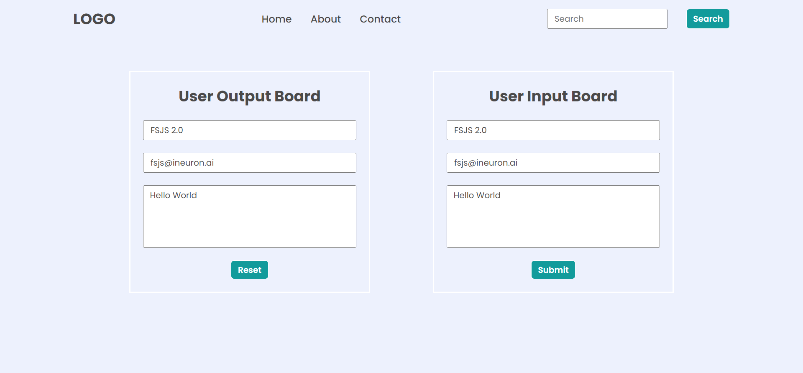

# Task output 


#### Change the Placeholder names 

# Code :-

``` js
  // For left side 
  let form = document.getElementByClassName("mainLeftDetails");
let name = form.getElementByClassName("enterName").placeholder="FSJS 2.0";

let mail = form.querySelector(".enterMail").placeholder = "fsjs@ineuron.ai";

let message = form.querySelector(".enterMessage").placeholder = "Hello World";
// For right side 
 let right = document.querySelector(".mainRight");
let uname = right.querySelector(".userName").placeholder="FSJS 2.0"

let umail = right.querySelector(".userEmail").placeholder="fsjs2.@ineuron.ai"

let umessage = right.querySelector(".userMessage").placeholder="Hello everyone"
```